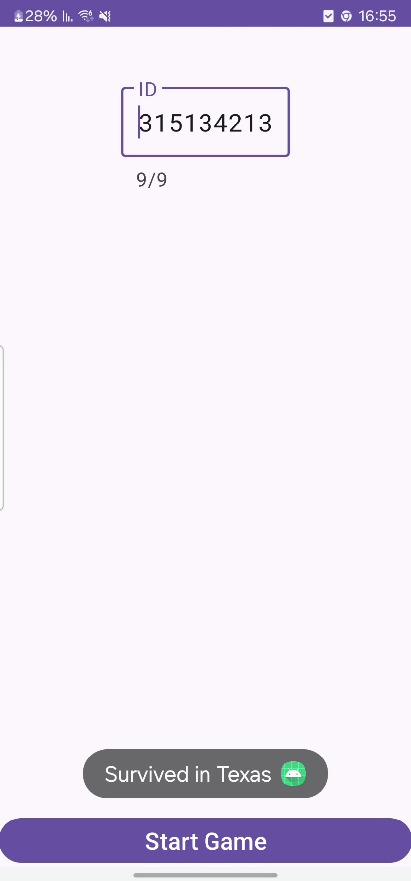

# Assignment 2 – Reverse Engineering an Android Arrow Game 🎯🔍

## 🧠 Overview

In this assignment, we were provided with an APK file and asked to reverse engineer it to reconstruct the original app and understand its game logic. The goal was to "survive" the game by entering our ID and identifying the correct sequence of arrows to reach a final destination (revealed via a toast message).

---

## 🔧 Reverse Engineering Process

### 1. APK Decompilation

- I used the **Android APK Decompiler** (online tool) to explore the APK contents.
- I filtered only the relevant files necessary to rebuild the app:
  - `Activity_Game.java`
  - `Activity_Menu.java`
  - Corresponding `XML` layout files
  - `strings.xml` for string resources (especially the URL)
  - Arrow image resources

Then, I created a new Android Studio project and imported these assets accordingly.

---

### 2. Bug #1 – Missing Internet Permission

Upon launching the app, it crashed immediately after entering the ID.  
Using **Logcat**, I found the error:
```text
SecurityException: Permission denied (missing INTERNET permission?)
```
✅ **Fix:** I added the following line to the `AndroidManifest.xml`:
```xml
<uses-permission android:name="android.permission.INTERNET" />
```
### 3. Bug #2 – Hidden Characters in the URL

Even after adding the `INTERNET` permission, the app still crashed.

After a deeper inspection, I discovered **invisible characters** (such as **zero-width spaces**) inside the URL string from `strings.xml`.

✅ **Fix:**  
I manually removed the hidden characters from the string, and after doing that, the app ran successfully 🎉

---

## 🔍 Game Logic Analysis

After restoring the app functionality, I analyzed this key part of the game logic:

```java
if (id.length() == this.steps.length) {
    for (int i = 0; i < steps.length; i++) {
        steps[i] = Integer.parseInt(id.charAt(i) + "") % 4;
    }
}
```
### 💡 What it means:
- Each digit of the entered ID is converted to an integer.

- Then it is processed using modulo 4 (% 4) to produce a number between 0–3.

- That number represents a direction for the player to follow.

- The actual direction mapping is defined here:
```java
this.arrows = new ImageButton[]{
    findViewById(R.id.game_BTN_left),   // index 0
    findViewById(R.id.game_BTN_right),  // index 1
    findViewById(R.id.game_BTN_up),     // index 2
    findViewById(R.id.game_BTN_down)    // index 3
};
```
---
## 🎮 Solving the Game (with ID: 315134213)

### Conversion:

| Digit | digit % 4 | Direction |
|--------|-------------|-----------|
| 3      | 3           | ↓ Down    |
| 1      | 1           | → Right   |
| 5      | 1           | → Right   |
| 1      | 1           | → Right   |
| 3      | 3           | ↓ Down    |
| 4      | 0           | ← Left    |
| 2      | 2           | ↑ Up      |
| 1      | 1           | → Right   |
| 3      | 3           | ↓ Down    |

➡️ **Arrow Sequence:**  
**↓ → → → ↓ ← ↑ → ↓**

After correctly completing the game, I received the toast: ``Survived in Texas``


---
## 🛠️ Tools Used

- **Android APK Decompiler** (Online)
- **Android Studio**
- **Logcat** (for runtime debugging and crash analysis)
- **Text editor** (used to detect and remove hidden/invisible characters)
- **Manual code review & Java logic analysis**

---

## ✅ Summary

I successfully **reverse engineered** the APK and **rebuilt the app** from its components.

During the process, I identified and resolved two critical issues:

1. **Missing Internet permission** – the app crashed due to lack of network access.
2. **Hidden/invisible characters in the URL string** – these characters broke the network call and caused crashes.

After debugging and cleaning the code:

- I analyzed the **arrow sequence logic** based on the user's ID using `modulo 4` arithmetic.
- Using that logic, I determined the correct sequence of button presses.
- Finally, I solved the game and received the success message:

---
## **Authors**

- [Gal Deri](https://github.com/galDeri23)


